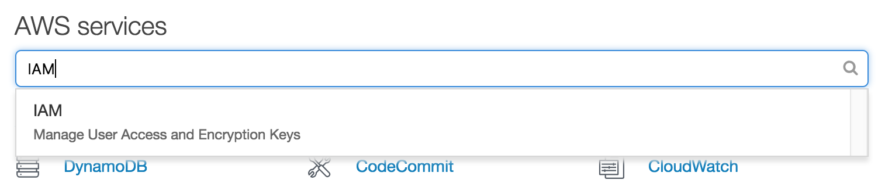
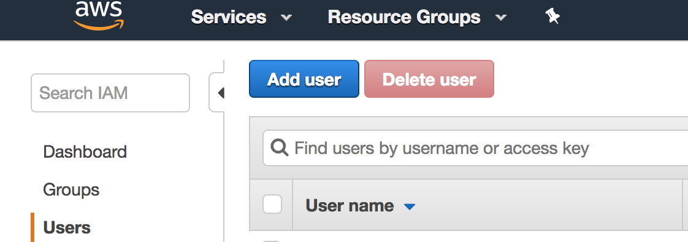

# Creating an IAM user
For security reasons, we want to create an IAM user immediately.

1. From the home dashboard type *IAM* into the search box at the top.
2. Choose *IAM Services* from the dropdown

3. 
<!--stackedit_data:
eyJoaXN0b3J5IjpbMTQ1MTkwODcyOSw3MTg1Njg5OTIsLTEyMT
A0MzI4LC0xOTc5OTEwMDM5LC03MDA1MzI4NTUsMTkxNDE4NDk5
MCwtMTY0MDkyOTMzNCwyMTA3NDUwNjQ5LDE1MDY1ODkxNDddfQ
==
-->