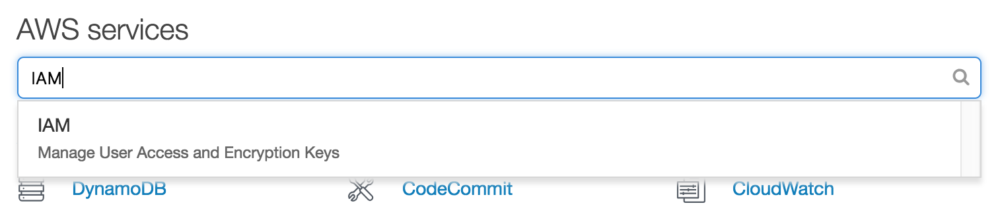

# Creating an IAM user
For security reasons, we want to create an IAM user immediately.

This should work
<!--stackedit_data:
eyJoaXN0b3J5IjpbLTE5Nzk5MTAwMzksLTcwMDUzMjg1NSwxOT
E0MTg0OTkwLC0xNjQwOTI5MzM0LDIxMDc0NTA2NDksMTUwNjU4
OTE0N119
-->